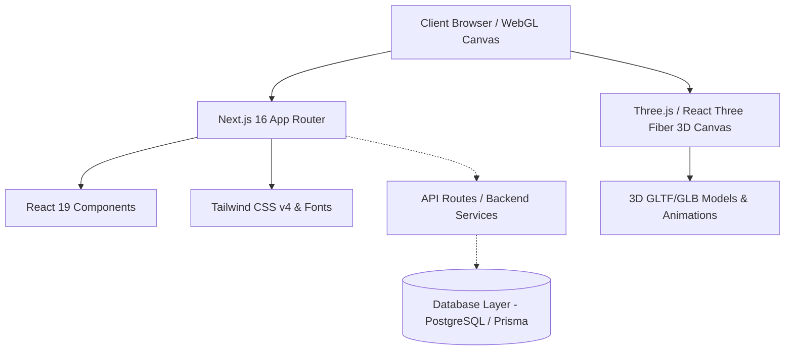
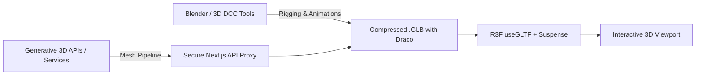

# Project Architecture & Technical Blueprint: Human

## 1. Executive Summary
The **Human** project is architected as a high-performance web platform designed to support rich, interactive 3D experiences featuring anatomical, human, and animal 3D models with responsive UI/UX and modular full-stack capabilities.

---

## 2. Current System Architecture



### 2.1 Framework & Core Engine
- **Framework**: Next.js 16.3.4 (App Router, Turbopack enabled)
- **Runtime**: React 19.2.8 / Node.js
- **Type Safety**: TypeScript 5 with strict typing
- **Styling**: Tailwind CSS v4 (`@tailwindcss/postcss`)

---

## 3. Frontend Architecture

### 3.1 Directory Layout
```text
src/
├── app/
│   ├── favicon.ico
│   ├── globals.css          # Design tokens, root CSS variables, Tailwind theme
│   ├── layout.tsx           # Root HTML structure, font optimizations (Geist)
│   └── page.tsx             # Main landing/entry view
└── (future modular architecture)
    ├── components/
    │   ├── 3d/              # Three.js / R3F canvases, loaders, shaders, controls
    │   ├── ui/              # Button, Modal, Card, Navbar, Tooltips (accessible)
    │   └── layout/          # Header, Sidebar, Footer, Viewport wrappers
    ├── hooks/               # Custom React hooks (3D viewport, viewport resizing, animations)
    ├── lib/                 # Utility functions (cn, math, 3D loader helpers)
    └── types/               # TypeScript interfaces & domain models
```

### 3.2 Existing UI/UX
- Currently contains the baseline Next.js App Router scaffold with Geist Sans / Geist Mono typography.
- Ready for full transformation into an immersive 3D interactive portal.

---

## 4. Backend & API Architecture

### 4.1 Current State
- Next.js server runtime ready for Route Handlers under `src/app/api/`.
- Zero active backend route handlers configured yet (pure frontend baseline).

### 4.2 Target API Design
- **REST / Route Handlers**: `src/app/api/v1/` for model metadata, user preferences, session state, and 3D asset manifest streaming.
- **Asset Delivery**: Optimized streaming for `.glb` / `.gltf` binary models with HTTP range requests and CDN caching headers.

---

## 5. Database & Data Persistence

### 5.1 Current State
- No active database connection or ORM installed in baseline.

### 5.2 Target Schema & Persistence Strategy
- **Recommended Database**: PostgreSQL (via Supabase or Neon) or Prisma / Drizzle ORM.
- **Core Entities**:
  - `User`: Authentication, profile, preferences, role-based access.
  - `ModelAsset`: 3D asset metadata (polygon count, rigging state, animations, preview thumbnails, file URLs, species/type: human vs animal).
  - `SceneConfiguration`: Lighting presets, camera angles, environment maps, material configs.
  - `UserSession / InteractionLog`: Analytics, custom configurations, saved camera states.

---

## 6. Authentication & Security

### 6.1 Security Posture
- Strict secret isolation: API keys, tokens, and backend credentials must live strictly in server environment variables (`process.env`), never exposed to client bundles or committed to Git.
- Comprehensive `.gitignore` already configured for `.env*`, `node_modules`, and build artifacts.

### 6.2 Target Auth Flow
- NextAuth.js (Auth.js) or Supabase Auth with OAuth / Magic Link / Credential flows.
- JWT session tokens with HTTP-only cookies and CSRF protection.

---

## 7. 3D Human & Animal Architecture

### 7.1 3D Tech Stack
- **Rendering Engine**: Three.js & `@react-three/fiber` (R3F)
- **Helper Ecosystem**: `@react-three/drei` (camera controls, environment staging, GLTF preloaders, shader helpers)
- **Animation Engine**: `@react-spring/three` or GSAP for cinematic camera transitions; Three.js `AnimationMixer` for skeletal animations.
- **Physics Engine (Optional)**: `@react-three/rapier` for realistic animal movement/ragdoll physics.

### 7.2 3D Asset Pipeline & Mesh Generation Strategy
> [!IMPORTANT]
> **AI Reasoning vs 3D Generation Engine**:
> Large language models serve as reasoning, architecture, scripting, and code generation agents. True high-fidelity 3D mesh generation (human anatomical meshes, organic animal topologies) relies on:
> 1. **Asset Pipeline**: High-poly sculpting (Blender / ZBrush) $\rightarrow$ Retopology $\rightarrow$ Rigging & Skeletal Animation $\rightarrow$ Draco / Meshopt compression $\rightarrow$ `.glb` export.
> 2. **Procedural & Generative 3D Pipelines**: Integration with dedicated 3D generation APIs (e.g., Tripo3D, Meshy, Rodin Gen-2, or Blender Python batch automation scripts) accessed via secure backend proxy endpoints.
> 3. **Interactive Shaders & Morph Targets**: Real-time blendshapes (facial expressions, muscular flex, animal gait) controlled via client-side WebGL uniforms.



---

## 8. Current Dependencies & Framework Versions

```json
{
  "dependencies": {
    "next": "16.3.4",
    "react": "19.2.8",
    "react-dom": "19.2.8",
    "lucide-react": "^1.x",
    "clsx": "^2.x",
    "tailwind-merge": "^3.x"
  },
  "devDependencies": {
    "@tailwindcss/postcss": "^4.x",
    "@types/node": "^20.x",
    "@types/react": "^19.x",
    "@types/react-dom": "^19.x",
    "eslint": "^9.x",
    "eslint-config-next": "16.3.4",
    "tailwindcss": "^4.x",
    "typescript": "^5.x"
  }
}
```

---

## 9. Technical Debt & Immediate Optimization Points

| Area | Current State | Recommendation |
| :--- | :--- | :--- |
| **3D Rendering** | Not installed | Install `three`, `@types/three`, `@react-three/fiber`, `@react-three/drei` |
| **Component Library** | Default scaffold | Build reusable UI component system (glassmorphic 3D control overlays) |
| **State Management** | None | Add `zustand` for lightweight 3D viewport state (camera, active model, animations) |
| **Asset Optimization** | None | Implement Draco/Meshopt decompression loaders for rapid 3D file delivery |

---

## 10. Phased Development Roadmap

### 📋 Phase 1 — UI/UX Design System
- Establish a visual language: Dark cinematic mode, glassmorphic HUD overlays, typography hierarchy.
- Build UI components: Model selector, animation controls, lighting adjuster, screenshot capture, camera position presets.

### 📋 Phase 2 — Frontend & 3D Canvas Foundation
- Install & configure Three.js, React Three Fiber, and Drei with React 19 compatibility.
- Implement responsive Canvas viewport with orbit controls, realistic studio lighting, shadows, and environment maps (`HDR/EXR`).
- Setup fallback loading skeletons with progressive loading and Suspense boundaries.

### 📋 Phase 3 — Backend & Asset Delivery
- Create Next.js API route handlers (`/api/models`, `/api/models/[id]`).
- Configure secure model streaming with gzip/brotli compression and asset caching headers.
- Implement secure proxy for third-party generative 3D integrations.

### 📋 Phase 4 — Database & Persistence
- Set up Prisma / Drizzle ORM with PostgreSQL.
- Implement schemas for models, categories (human, animal, anatomy), user bookmarks, and custom scene configs.

### 📋 Phase 5 — 3D Human & Animal Interactive System
- Implement human model viewer with skeletal rigging and animation player (idle, walk, run, gesture).
- Implement animal model viewer with species switching and interactive gait/behavior animations.
- Add anatomical layer toggling (skin, muscular, skeletal, organ systems).
- Integrate Blender Python automation pipeline scripts for asset processing.

### 📋 Phase 6 — Testing & Quality Assurance
- Unit tests for API routes, data utilities, and state managers.
- Visual regression and WebGL context loss recovery tests.
- Cross-browser and device compatibility checks (touch gestures on mobile/tablet).

### 📋 Phase 7 — Performance & Optimization
- Implement Draco/Meshopt geometry compression (reducing 3D asset size by up to 80%).
- Level of Detail (LOD) mesh rendering and frustum culling for complex scenes.
- Dynamic resolution scaling for lower-end GPU hardware.

### 📋 Phase 8 — Production Deployment & CI/CD
- Automated GitHub Actions workflow for linting, type-checking, and build validation.
- Vercel or containerized Docker deployment with global Edge CDN caching for 3D binary assets.
